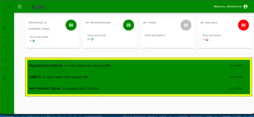
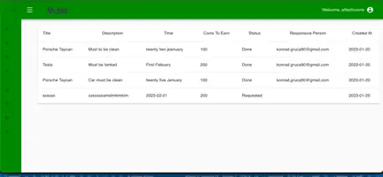
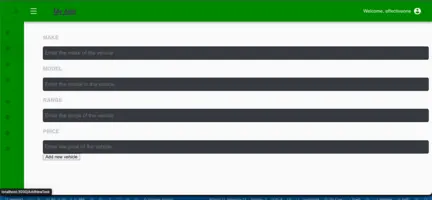
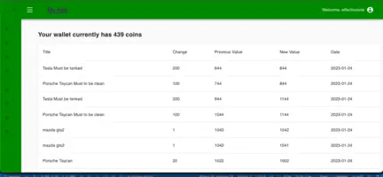
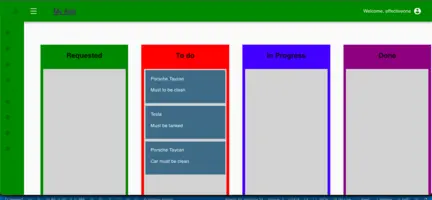
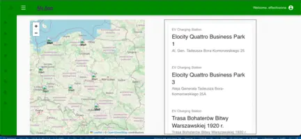

 <h1 align="center">MangoDb, Express, React, Node, Material UI, SASS, Redux, Jest, React Testing Library, Prettier, esLint, Boilerplate</h1>

## Electric Cars Management System

Welcome to our Electric Cars Management System! This project is designed to make it easy for users to manage and share electric cars, as well as rent them for a fee.

## Features

- Add Announcements: Users can add announcements to the system, which will be visible to all other users.
- Create Tasks: Users can create tasks, which will be assigned to specific cars and visible to all other users.
- Add Cars: Users can add cars to the system, which will be available for sharing and renting.
  Rent Cars: Users can rent cars for a fee, which will be paid in coins.
- Map of Electric Stations: Users can view a map of electric stations, which will be helpful for finding charging locations.
  Tech Stack

###Frontend: We used React to build the frontend of the application, along with various libraries such as Material-UI, Emotion, and Leaflet.
###Backend: We used Node.js as the backend of the application, along with Express.js and MongoDB.

## Screenshots

<div style="display: grid; grid-template-columns: repeat(2, 1fr); grid-template-rows: repeat(3, 1fr);">
  
  
  
  
  
  
</div>

## Getting Started

To run the application using Docker, follow these steps:

1. **Install Docker and Docker Compose:**
   Make sure you have Docker and Docker Compose installed on your machine.

2. **Clone the repository:**
   Clone the repository to your local environment:
   ```bash
   git clone [repository_url]
   cd [repository_name]
   ```

- **Build and run the application using Docker Compose:**
  In the project directory containing the `docker-compose.yml` file, run the following command:

```bash
docker-compose up -d --build
```

his command will build Docker images and start containers as per the configuration in the docker-compose.yml file.

Now, your application should be running in Docker containers, with the frontend and backend operating on their respective ports. Open a web browser and check localhost:3000 for the frontend and the specified address for the backend.

## Dummy Data and Admin Login

This project includes built-in dummy data that is saved during the build process. To access additional features, it's recommended to log in as an administrator. Here are the details:

- **Admin Email:** admin@example.com
- **Admin Password:** admin12

After logging in as an administrator, you will have access to additional functionalities and data, allowing you to explore and test various aspects of the Electric Cars Management System.

## Contributions

We welcome contributions to the project! If you have any ideas or issues you'd like to report, feel free to create a new issue or pull request.

## Future Plans

In the future, we plan to add new features to the application, such as the ability to make reservations and view statistics about the usage of the cars.

## License

All rights reserved
##👨‍💻 Connect with me
Konrad.gruca90@gmail.com

```

```
